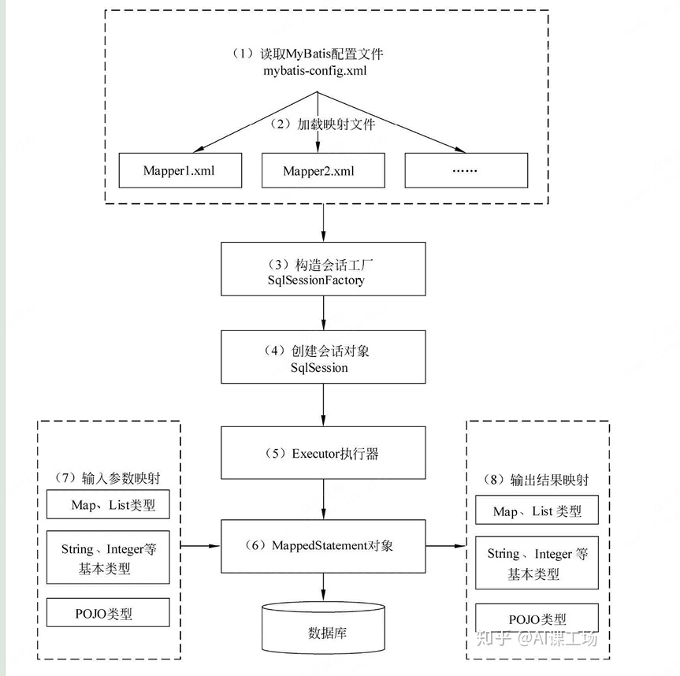
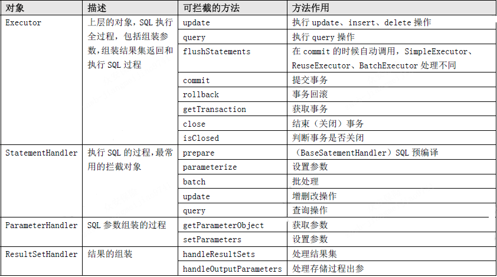

# 简介
```text
Mybatis是一个开源的数据持久化框架，封装了通过JDBC访问数据库的操作，如加载驱动、创建关闭连接等,消除了JDBC大量冗余的代码；
Mybatis作为一个半ORM(对象关系映射)框架，MyBatis可以使用 XML 或注解来配置和映射原生信息，将POJO映射成数据库中的记录，避免了几乎所有的JDBC代码和参数的手动设置以及结果集的检索；
Mybatis基于SQL语句编程，SQL语句写在XML映射文件中，提供XML标签，支持编写动态SQL语句，并可重用，同时实现SQL语句与程序代码的解耦，便于统一管理；
```
# 执行流程

```text
1、通过Mybatis提供的工具类Resources加载配置文件并初始化返回流对象InputStream
2、通过new SqlSessionFactoryBuilder().build(InputStream)创建SqlSessionFactory
3、SqlSessionFactory调用openSession()方法获取事务工厂TransactionFactory、创建Executor执行器对象，返回DefaultSqlSession
4、SqlSession封装了很多跟数据库操作相关的方法，通常通过定义Dao接口自定义SQL方法
5、SqlSession调用getMapper()获取Dao接口的代理对象MapperProxy(JDK动态代理实现，与XML映射文件的namespace+id定位到MappedStatement对象绑定)
6、方法调用时，MappedStatement对输入参数预编译并preparedStatement的set方法赋值，执行SQL语句
7、最终将SQL的结果集映射到JavaBean对象
```
```text
SqlSessionFactoryBuild：
创建完 SqlSessionFactory，就不再需要它了。 因此 SqlSessionFactoryBuilder 实例的最佳作用域是方法作用域（也就是局部方法变量）

SqlSessionFactory： 
一旦被创建就应该在应用的运行期间一直存在，没有任何理由丢弃它或重新创建另一个实例。因此 SqlSessionFactory 的最佳作用域是应用作用域。 最简单的就是使用单例模式。

SqlSession：
每个线程都应该有它自己的 SqlSession 实例。SqlSession 的实例不是线程安全的，因此是不能被共享的，所以它的最佳的作用域是请求或方法作用域。 
绝对不能将 SqlSession 实例的引用放在一个类的静态域，甚至一个类的实例变量也不行。 也绝不能将 SqlSession 实例的引用放在任何类型的托管作用域中，
比如 Servlet 框架中的 HttpSession。 如果你现在正在使用一种 Web 框架，考虑将 SqlSession 放在一个和 HTTP 请求相似的作用域中。 
换句话说，每次收到 HTTP 请求，就可以打开一个 SqlSession，返回一个响应后，就关闭它。 
这个关闭操作很重要，为了确保每次都能执行关闭操作，你应该把这个关闭操作放到 finally 块中。
```
# JDBC、Hibernate、MyBatis
```text
JDBC：
频繁创建释放数据库连接，资源开销大
SQL语句与程序代码耦合，不易维护
手动设置参数以及结果集检索

MyBatis：
封装了JDBC，消除了大量的冗余代码，如驱动加载，连接资源创建与释放
基于SQL编程，SQL语句写在XML映射文件中，与程序代理解耦，方便统一管理
SQL参数预处理动态赋值以及可配置的结果集高级映射
提供XML标签，支持动态SQL
半ORM框架，查询关联对象或关联集合对象时，需要手动编写sql来完成，通过resultMap标签实现
SQL语句依赖于数据库，导致数据库移植性差，不能随意更换数据库

Hibernate：
全ORM框架，查询关联对象或者关联集合对象时，可以根据对象关系模型直接获取
与数据库无关性好
```
# dao接口与Mapper.xml的工作原理？Dao接口里的方法，参数不同时，方法能重载吗？
```text
Dao接口的工作原理是JDK动态代理，Mybatis运行时会使用JDK动态代理为Dao接口生成代理对象 MappedProxy，代理对象会拦截接口方法，根据类的全限定名+方法名，
去匹配XML映射文件中的namespace+SQL标签的id，然后唯一定位到一个MapperStatement(SQL标签的实例对象)并调用执行器执行所代表的sql语句，最后返回结果集。

Dao接口里的方法，是不能重载的，因为是使用 全限名+方法名 的寻找匹配策略。
```
# #{}和${}的区别
```text
${}是字符串替换，#{}是预处理；使用#{}可以有效的防止SQL注入，提高系统安全性。
Mybatis在处理${}时，就是把${}直接替换成变量的值。而Mybatis在处理#{}时，会对sql语句进行预处理，将sql中的#{}替换为?号，调用PreparedStatement的set方法来赋值；
```
# 参数传递
```text
1、通过下标获取：arg0、arg1、arg2 或 param1、param2、param3
2、使用Map当作参数
3、使用@Parm("")注解
4、使用JavaBean传参
```
# 字段不一致
```text
1、使用数据库自带 AS关键字的别名功能
2、使用resultMap标签进行高级映射
```
# 模糊查询
```text
1、在Java代码中添加sql通配符。
2、动态SQL bind标签<bind name="pattern" value="'%' + 参数名 + '%'" />
3、使用CONCAT()函数连接参数形式
```
# 延迟加载及其实现原理
```text
Mybatis仅支持association关联对象和collection关联集合对象的延迟加载，association指的就是一对一，collection指的就是一对多查询。
在Mybatis配置文件中，可以配置是否启用延迟加载
全局：lazyLoadingEnabled=true|false。
局部：fetchType="lazy"

延迟加载主要是通过CGLIB动态代理实现的，调用懒加载属性时发现为null，代理对象会单独发送关联查询的SQL，再通过set方法赋值。
```
# 批量操作
```text
1、使用foreach标签
2、使用ExecutorType.BATCH
Mybatis内置的ExecutorType有3种，
默认为simple,该模式下它为每个语句的执行创建一个新的预处理语句，单条提交sql；
而batch模式重复使用已经预处理的语句，并且批量执行所有更新语句，显然batch性能将更优； 
但batch模式也有自己的问题，比如在Insert操作时，在事务没有提交之前，是没有办法获取到自增的id，这在某型情形下是不符合业务要求的

创建SqlSession时，传入参数ExecutorType.Batch，并且设置事务不自动提交
```
# 分页实现
```text
1、物理分页：直接SQL语句使用 limit语法
2、内存分页(new RowBounds)：先取出所有数据，然后游标移动到offset位置，循环取limit条数据，然后把剩下的数据舍弃。
3、分页插件(PageHelper)：分页插件的基本原理是使用Mybatis提供的插件接口，实现自定义插件，在插件的拦截方法内拦截待执行的sql，然后重写sql，添加对应的物理分页语句和物理分页参数。
```
# 插件机制
## 应用场景
```text
Mybatis插件典型适用场景
分页功能
mybatis的分页默认是基于内存分页的（查出所有，再截取），数据量大的情况下效率较低，
不过使用mybatis插件可以改变该行为，只需要拦截StatementHandler类的prepare方法，改变要执行的SQL语句为分页语句即可；

公共字段统一赋值
一般业务系统都会有创建者，创建时间，修改者，修改时间四个字段，对于这四个字段的赋值，实际上可以在DAO层统一拦截处理，
可以用mybatis插件拦截Executor类的update方法，对相关参数进行统一赋值即可；

性能监控
对于SQL语句执行的性能监控，可以通过拦截Executor类的update, query等方法，用日志记录每个方法执行的时间；
```
## 自定义分页插件
拦截阶段以及支持拦截的方法

实现原理：
```text 
简单的说，mybatis插件就是对ParameterHandler、ResultSetHandler、StatementHandler、Executor这四个接口上的方法进行拦截，
利用JDK动态代理机制和反射机制，为这些接口的实现类创建代理对象，在执行方法时，先去执行代理对象的方法，从而执行自己编写的拦截逻辑 
```


# 缓存机制
## 一级缓存
默认情况是开启的，SqlSession级别的缓存也称为本地会话缓存(Local Cache)
一级缓存失效情况
```text
1、一次数据库会话中，进行了增删改操作
2、不同的SqlSession
```

## 二级缓存
需要手动启动，基于namespace级别的缓存


